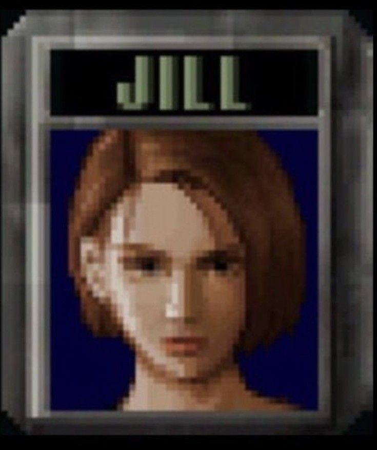
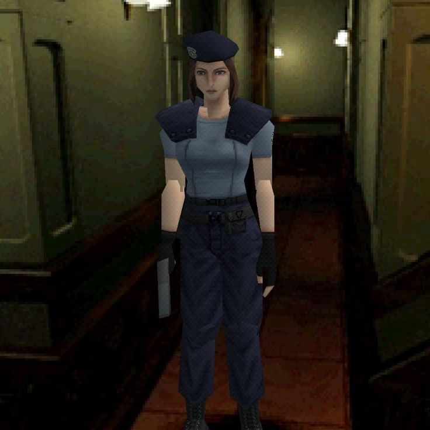

<div align="center">

# 🧟‍♀️ Resident Evil: Director's Cut — Android

### Download • Installation • DuckStation Setup • Controller Guide



### 🇧🇷 Guia em Português | 🇺🇸 English Guide

Um guia simples para configurar **Resident Evil: Director's Cut** no Android utilizando DuckStation.

</div>

---

# 🇧🇷 Português

## 🧟‍♀️ Sobre este repositório

Este projeto foi criado para facilitar ao máximo o processo de configuração do **Resident Evil: Director's Cut no Android**.

Aqui você encontrará:

- 📥 Uma seção dedicada aos **downloads utilizados pelo guia**
- 🎮 Instruções para configurar o **DuckStation**
- ⚙️ Instruções para configurar os arquivos necessários
- 🎮 Configuração de controles Bluetooth/USB
- 📱 Como remover os controles virtuais da tela
- 💙 Algumas imagens da Jill porque sim

O objetivo é deixar tudo organizado em um único lugar para que você não precise procurar cada etapa separadamente.

<div align="center">




</div>

---

# 📥 DOWNLOADS

## ☁️ Google Drive

Os arquivos utilizados junto deste guia são grandes demais para serem armazenados diretamente neste repositório do GitHub.

Por isso, existe uma pasta separada no **Google Drive** para os downloads disponibilizados pelo projeto.

### ⬇️ DOWNLOAD

## 📁 [ACESSAR PASTA DE DOWNLOADS](https://drive.google.com/drive/folders/1cj4E5MJoyUSm2_FpwbqVLrJ1UqT1s-6e?usp=drive_link)

> 💡 **Importante:** este guia foi organizado especificamente pensando na versão **Resident Evil: Director's Cut (USA)** original.
>
> Isso foi feito para evitar confusão com outras edições do jogo, principalmente **Resident Evil: Director's Cut - Dual Shock Ver.**

### ⚠️ Aviso

Verifique se você possui o direito de utilizar os arquivos disponibilizados ou referenciados pelo projeto em sua região.

---

# 💿 Versão utilizada

Todo o tutorial abaixo foi feito utilizando:

```text
Resident Evil - Director's Cut (USA)
```

### ❌ Não é:

```text
Resident Evil - Director's Cut - Dual Shock Ver. (USA)
```

Existem diversas versões do primeiro Resident Evil para PlayStation.

Para deixar o processo mais simples, este guia utiliza somente a **Director's Cut original**.

---

# 🎮 Instalando o DuckStation

O **DuckStation** é o emulador utilizado neste guia.

Depois de instalar o aplicativo no Android, abra-o e conclua a configuração inicial.

---

# ⚙️ Configurando a BIOS

O DuckStation precisa de uma BIOS compatível do PlayStation para inicializar os jogos.

Caso nenhuma BIOS esteja configurada, poderá aparecer:

```text
Missing BIOS Image
```

Selecione a opção para localizar/importar uma BIOS e indique o arquivo correspondente no seu dispositivo.

Depois disso, o DuckStation estará pronto para iniciar jogos.

---

# 💿 Adicionando Resident Evil

Na tela principal do DuckStation, toque em:

```text
Add Game Directory
```

O Android abrirá o seletor de arquivos.

Selecione a **pasta onde está armazenado o jogo**.

Você não precisa selecionar diretamente o arquivo individual.

O DuckStation irá analisar a pasta e adicionar automaticamente os jogos encontrados.

Se tudo estiver correto, deverá aparecer:

```text
Resident Evil - Director's Cut (USA)
```

na biblioteca.

---

# 🎮 Configurando um controle

Este passo é opcional, mas é **altamente recomendado** para jogar Resident Evil no celular.

Primeiro conecte seu controle ao Android através de:

- Bluetooth
- USB/OTG

Depois abra:

```text
Settings
└── Controller Settings
    └── Port 1
```

Em:

```text
Controller Type
```

selecione:

```text
Analog Controller (DualShock)
```

Depois utilize:

```text
Perform Automatic Mapping
```

O DuckStation deverá detectar seu controle e mapear automaticamente os botões.

---

# 📱 Removendo os botões da tela

Se estiver utilizando um controle físico, você pode remover completamente os controles touchscreen.

Abra:

```text
Controller Settings
└── Touchscreen
```

Procure:

```text
Touchscreen Controller View
```

e selecione:

```text
None
```

Pronto. 🎮

Agora o Resident Evil ficará com a tela limpa e será controlado somente pelo controle físico.

---

# 🧟‍♀️ Começando o jogo

Para quem nunca jogou o Resident Evil clássico antes, minha recomendação é:

### 🎯 Dificuldade

```text
STANDARD
```

### 💙 Personagem

```text
JILL VALENTINE
```

Obviamente.

---

<div align="center">


### 💙 Jill Valentine

**1996 → RE3 Remake**

</div>

---

# 🇺🇸 English

## 🧟‍♀️ About this repository

This project was created to make the process of setting up **Resident Evil: Director's Cut on Android** as simple as possible.

Here you will find:

- 📥 A dedicated **download section**
- 🎮 DuckStation setup instructions
- ⚙️ Instructions for configuring the required files
- 🎮 Bluetooth/USB controller configuration
- 📱 Instructions for disabling touchscreen controls
- 💙 Some Jill pictures because why not

The goal is to keep the entire process organized in one place.

<div align="center">


</div>

---

# 📥 DOWNLOADS

## ☁️ Google Drive

Some files used alongside this guide are too large to be stored directly in this GitHub repository.

For this reason, a separate **Google Drive folder** is available for the downloads provided with this project.

### ⬇️ DOWNLOAD

## 📁 [OPEN DOWNLOAD FOLDER](https://drive.google.com/drive/folders/1cj4E5MJoyUSm2_FpwbqVLrJ1UqT1s-6e?usp=drive_link)

> 💡 **Important:** This guide was specifically organized around the original **Resident Evil: Director's Cut (USA)** release.
>
> This avoids confusion with other releases, especially **Resident Evil: Director's Cut - Dual Shock Ver.**

### ⚠️ Notice

Make sure you have the legal right to use any files provided or referenced by this project in your region.

---

# 💿 Version used

The entire tutorial below is based on:

```text
Resident Evil - Director's Cut (USA)
```

### ❌ Not:

```text
Resident Evil - Director's Cut - Dual Shock Ver. (USA)
```

Several versions of the original Resident Evil were released for PlayStation.

To keep everything simple, this guide focuses exclusively on the **original Director's Cut**.

---

# 🎮 Installing DuckStation

**DuckStation** is the emulator used by this guide.

Install DuckStation on your Android device and complete the initial setup.

---

# ⚙️ BIOS Setup

DuckStation requires a compatible PlayStation BIOS to boot games.

If no BIOS has been configured, you may see:

```text
Missing BIOS Image
```

Choose the option to locate/import a BIOS and select the corresponding file on your device.

After importing it, DuckStation should be ready to boot PlayStation games.

---

# 💿 Adding Resident Evil

From DuckStation's main screen, select:

```text
Add Game Directory
```

Android will open its file picker.

Select the **folder containing the game**.

You don't need to manually select the individual game file.

DuckStation will scan the directory and automatically add supported games to your library.

If everything is configured correctly, you should see:

```text
Resident Evil - Director's Cut (USA)
```

---

# 🎮 Controller Setup

Using a physical controller is optional, but **highly recommended**.

Connect your controller to Android through:

- Bluetooth
- USB/OTG

Then open:

```text
Settings
└── Controller Settings
    └── Port 1
```

Under:

```text
Controller Type
```

select:

```text
Analog Controller (DualShock)
```

Then choose:

```text
Perform Automatic Mapping
```

DuckStation should automatically detect and map your controller.

---

# 📱 Disable Touchscreen Controls

If you're using a physical controller, the touchscreen controls can be completely disabled.

Open:

```text
Controller Settings
└── Touchscreen
```

Find:

```text
Touchscreen Controller View
```

and select:

```text
None
```

Done. 🎮

You'll now have a clean game screen without virtual buttons.

---

# 🧟‍♀️ Starting the Game

For your first classic Resident Evil playthrough, I recommend:

### 🎯 Difficulty

```text
STANDARD
```

### 💙 Character

```text
JILL VALENTINE
```

Obviously.

---

<div align="center">


### 💙 Jill Valentine

**1996 → RE3 Remake**

</div>

---

# ⚖️ Disclaimer

This is an unofficial, fan-made project.

**Resident Evil**, **Jill Valentine**, PlayStation and all related trademarks belong to their respective owners.

This project is not affiliated with or endorsed by **CAPCOM**, Sony or the DuckStation developers.

Users are responsible for ensuring they have the legal right to use any files provided, downloaded or referenced by this project.

---

<div align="center">

# ⭐ S.T.A.R.S. ⭐

### Made by a Resident Evil fan, for Resident Evil fans.


</div>
